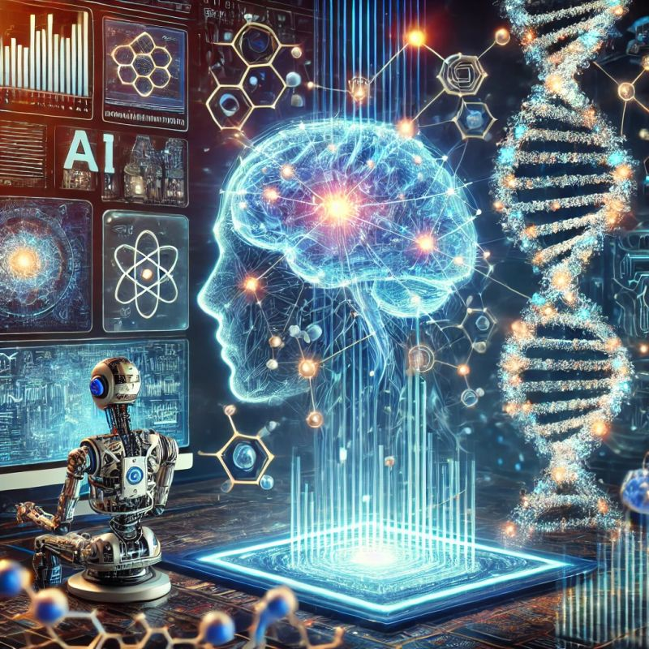

# Hi 👋, I'm Vaishnavi Bhamre

<table>
<tr>
<td>

### Bioinformatics | Machine Learning | Multi-Omics | Drug Discovery

I work at the intersection of **bioinformatics, machine learning, and computational biology** to decode complex biological systems. My work spans **multi-omics integration, NGS pipelines, and AI-driven biomarker discovery** — combining statistical rigor, scalable pipelines, and clinical intuition to turn raw data into biological insight.

🎓 **M.S. Bioinformatics — Northeastern University, Boston** *(GPA: 3.84)*
🎓 **B.Pharm — RGPV University, India**

🌐 **LinkedIn:** [linkedin.com/in/vaishnavi-bhamre](https://linkedin.com/in/vaishnavi-bhamre)

</td>
<td align="center" width="40%">

</td>
</tr>
</table>

---

## 🔬 Research Interests

- Multi-omics integration (RNA-seq, WGS, metagenomics)
- Cancer genomics & tumor microenvironment analysis
- ML models for clinical & biomedical prediction
- Gut microbiome & metabolic disease
- AI-driven drug target identification & nanoparticle delivery
- - Behavioral neuroscience & neural circuit analysis
- Neurodegenerative disease genomics (Alzheimer's & Parkinson's) — multi-omics approaches to uncover molecular mechanisms and therapeutic targets

---

## 🛠️ Skills & Tech Stack

**AI / ML & Data Science**
`Scikit-learn` `Random Forest` `GBM` `Naive Bayes` `Logistic Regression` `Ensemble Methods` `Cross-validation` `Hyperparameter Tuning` `AUC-ROC`

**Bioinformatics & NGS**
`RNA-Seq` `WGS` `GATK` `STAR` `BWA` `SAMtools` `DESeq2` `edgeR` `limma` `QIIME2` `PICRUSt2` `CIBERSORTx` `BLAST` `PyMOL` `AutoDock Vina`

**Programming**
`Python` `R` `SQL` `Unix/Linux` `Git` `Docker`

---

## 🚀 Current Projects

### 🫁 Decoding Lung Cancer Subtypes Through Multi-Omics Integration
Built an end-to-end pipeline integrating RNA-seq, somatic mutations (MAF), and clinical data from 400+ TCGA-LUAD patients. Applied DESeq2, PCA, K-means clustering, Kaplan-Meier survival analysis, and CIBERSORTx to characterize tumor subtypes and immune microenvironment remodeling driven by EGFR, KRAS, TP53 alterations.

### 🧠 Mental Health State Prediction — Automated ML Pipeline
5,000-record classification pipeline in R (CRISP-DM): engineered behavioral features from social media & lifestyle data, trained and stacked Naive Bayes, Logistic Regression, Random Forest, and GBM models with a meta-learner to predict Healthy / Stressed / At-Risk states.

### 🦠 Gut Microbiome & Glycemic Response in Type 2 Diabetes
Fully containerized (Docker + QIIME2) metagenomics pipeline: DADA2 denoising, MAFFT alignment, FastTree phylogenetics, UniFrac diversity, PICRUSt2 functional prediction — identified 15 biomarkers correlating with glycemic response via random forest classification.

---

## 📜 Publications & Highlights

- 🏆 **SAC-ACCP International Conference (2023)** — Presented research on Solid Lipid Nanoparticles for targeted Nateglinide delivery to 100+ pharmaceutical professionals
- 💊 **Co-authored "Current and Emerging Therapies for Type II Diabetes Mellitus"** — peer-reviewed article synthesizing disease mechanisms, pharmacology, and therapeutic data; demonstrates scientific communication and analytical depth 

---

## 📫 Get in Touch

- 📧 bhamre.v@northeastern.edu
- 📧 bhamrevaishnaviboston@gmail.com
- 📍 Boston, MA
  
## 🌐 Connect With Me

</table>
---

## 🐍 Slithering Through My Commits

